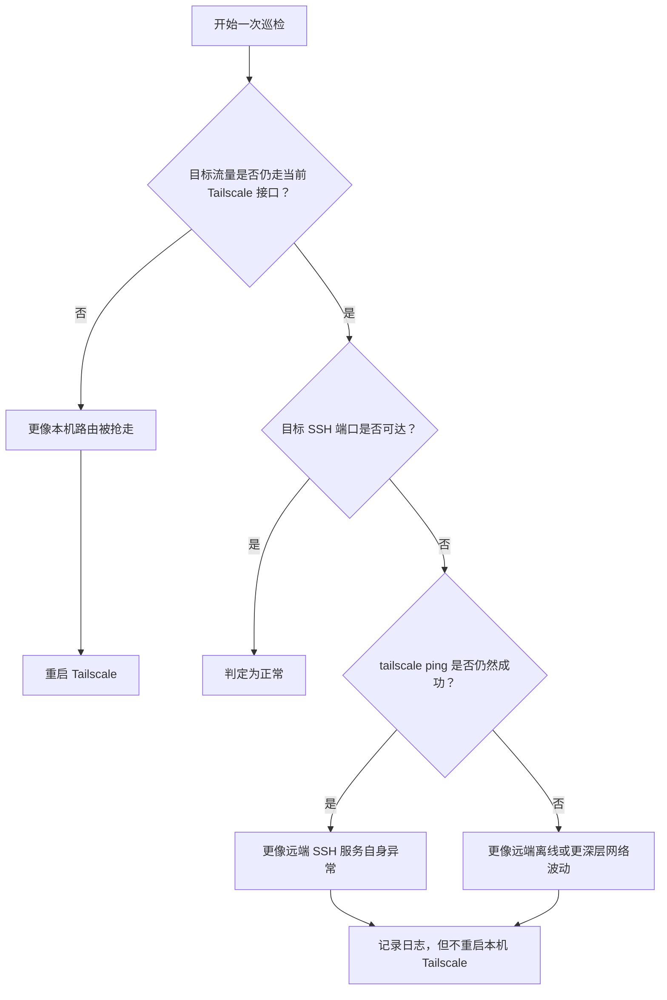

# tailscale-shadowrocket-ssh-heal

一个面向 macOS 的原生 SSH 自愈方案，用来处理 Tailscale 与 Shadowrocket 一类 TUN/Packet Tunnel 应用同时运行时，偶发的路由争用问题。

它解决的不是“完全连不上 Tailscale”，而是这样一种更容易让人误判的状态：

- `tailscale status` 看起来正常
- `tailscale ping` 往往也还能通
- 远端节点在 tailnet 里仍然在线
- 但原生 `ssh user@100.x.x.x` 已经失败
- 手动执行一次 `tailscale down` 再 `tailscale up` 后，SSH 往往又恢复

如果你遇到的正是这个问题，这个仓库大概率就是为你准备的。

## 这个仓库解决什么问题

在 macOS 上，Tailscale 和 Shadowrocket、Clash、Surge 这类会接管系统流量的 TUN/Packet Tunnel 应用，可以同时存在，但它们都可能影响：

- 虚拟隧道接口
- 特定网段的路由归属
- 普通应用的 TCP 流量走向

一旦路由在某个时刻被刷新错了，就会出现一种很迷惑的现象：

- `tailscaled` 自己仍然知道怎么联系对端
- 但普通应用的系统 TCP 流量，已经没有走到 Tailscale 当前实际使用的接口

所以问题的根因不是“SSH 协议和 Tailscale 冲突”，而是：

**同一台主机上的多条隧道都在争夺流量接管权，最终导致原生 SSH 使用的系统路由偏离了 Tailscale 期望的路径。**

这个仓库把问题背景、排查方法、脚本实现和自愈策略整理成了一套可以直接复用的方案。

## 这套方案会做什么

- 检查目标流量是否仍然走到当前 Tailscale 接口
- 检查目标 SSH 端口是否真的可达
- 用 `tailscale ping` 作为辅助信号，降低误判
- 只有更像“本机 Tailscale/本机路由异常”时才自动重启 Tailscale
- 使用 macOS `launchd` 做后台定时巡检
- 支持睡眠唤醒后的补检
- 每天跨过 0 点后自动恢复到 3 分钟基础检查间隔
- 对退避后的最大检查间隔做上限控制
- 记录中文日志、状态文件和动态退避信息

换句话说，它不是简单地“定时重启 Tailscale”，而是尽量先判断清楚：

- 到底是本机路由坏了
- 还是远端 SSH 自己有问题
- 或者只是远端节点暂时不可达

## 判断逻辑



这个判断模型的核心目的，是减少单目标误判，避免“远端 SSH 自己挂了”时，脚本还在盲目重启本机 Tailscale。

## 仓库结构

```text
.
├── README.md
├── docs
│   └── DEEP_DIVE.md
└── scripts
    ├── restart-tailscale.sh
    ├── check-and-heal-tailscale-ssh.sh
    └── watch-tailscale-ssh.sh
```

各部分作用如下：

- `README.md`
  适合第一次打开仓库时快速了解用途、适用场景和用法
- `docs/DEEP_DIVE.md`
  更完整的背景知识、排查过程、原理解释和设计思路
- `scripts/`
  可直接使用的脚本实现

## 快速开始

### 1. 克隆仓库

```bash
git clone git@github.com:KaiXinChaoRen1/tailscale-shadowrocket-ssh-heal.git
cd tailscale-shadowrocket-ssh-heal
```

### 2. 给脚本执行权限

```bash
chmod +x scripts/restart-tailscale.sh
chmod +x scripts/check-and-heal-tailscale-ssh.sh
chmod +x scripts/watch-tailscale-ssh.sh
```

### 3. 启动后台巡检

```bash
zsh scripts/watch-tailscale-ssh.sh start
```

默认参数：

- 目标 IP：`100.82.42.75`
- 目标端口：`22`
- 基础检查间隔：`180` 秒，也就是 3 分钟

### 4. 常用命令

查看状态：

```bash
zsh scripts/watch-tailscale-ssh.sh status
```

重新安装并启动：

```bash
zsh scripts/watch-tailscale-ssh.sh restart
```

停止后台巡检：

```bash
zsh scripts/watch-tailscale-ssh.sh stop
```

指定不同目标和间隔：

```bash
zsh scripts/watch-tailscale-ssh.sh restart 100.82.42.75 22 180
```

## 它是怎么在后台工作的

这套方案用的是 macOS 的 `launchd`，而不是传统的“脚本自己常驻 `while true + sleep`”模式。

当前设计是：

- `launchd` 按基础间隔唤起一次脚本
- 脚本读取状态文件，判断这次是否真正需要执行检查
- 如果连续两次“本机异常并已触发重启”，就把检查间隔翻倍
- 退避后的最大检查间隔上限是 1 小时
- 每天跨过 0 点后，检查间隔和连续异常计数都会恢复到基础值
- 只要后面恢复正常，间隔就回到基础值

这样做有几个好处：

- 更适合笔记本电脑，不需要长期保留一个后台死循环
- 资源占用更低
- 睡眠期间错过检查点后，唤醒时更容易补跑
- 退避逻辑也能继续保留

## 日志和状态文件

日志文件路径：

```bash
~/Library/Logs/tailscale-ssh-heal.log
```

状态文件路径：

```bash
~/Library/Application Support/tailscale-ssh-heal/state.env
```

日志主要记录：

- 后台巡检启动
- 本机异常并已触发重启
- 异常但未触发重启
- 退避策略生效
- 恢复正常
- 脚本执行错误

状态文件主要记录：

- 当前检查间隔
- 连续异常次数
- 最近一次结果
- 上次检查时间
- 下次允许检查的时间
- 最近一次跨天重置发生在哪一天

出于安全性考虑，脚本不会直接把状态文件当 shell 脚本去 `source`，而是只解析受控的键值字段。

## 适合什么人使用

这个项目更适合下面这些人：

- 在 macOS 上同时使用 Tailscale 和 Shadowrocket / Clash / Surge / 其他 TUN 类代理的人
- 想继续使用原生 `sshd`，而不是 Tailscale SSH 的人
- 遇到“`tailscale ping` 通，但原生 SSH 不通”的人
- 想把问题查清楚，而不只是临时重启一下的人

## 不适合解决哪些问题

这不是一个通用网络修复器。它主要针对的是：

- Tailscale 本身大体仍然正常
- macOS 原生 `sshd` 已开启
- 问题主要来自多隧道并存时的路由归属偏移
- 重启 Tailscale 对这类问题通常有效

它不负责修复这些问题：

- 远端机器自己没开 SSH
- Tailscale 账号或控制面本身故障
- 局域网、路由器、运营商一类更大范围的网络问题
- 需要同时管理很多远端目标的复杂巡检编排

## 建议怎么阅读

如果你只是想先用起来，可以按这个顺序：

1. 看完这页 README
2. 直接跑 `scripts/watch-tailscale-ssh.sh start`
3. 看日志确认行为是否符合预期

如果你想彻底搞懂问题原理，建议继续读：

- [`docs/DEEP_DIVE.md`](./docs/DEEP_DIVE.md)

这份文档会更完整地解释：

- 为什么 `tailscale ping` 能通，但原生 SSH 不通
- 为什么这不是协议冲突，而是路由归属冲突
- 为什么脚本不能只盯一个端口
- 为什么新的调度方式更适合睡眠唤醒场景

## 说明

- 这不是 Tailscale 或 Shadowrocket 官方项目
- 这套方案默认只对当前机器的 Tailscale 做保守自愈
- 使用前建议先理解脚本逻辑，并确认你接受“异常时自动重启 Tailscale”这一行为

## License

[MIT](./LICENSE)
