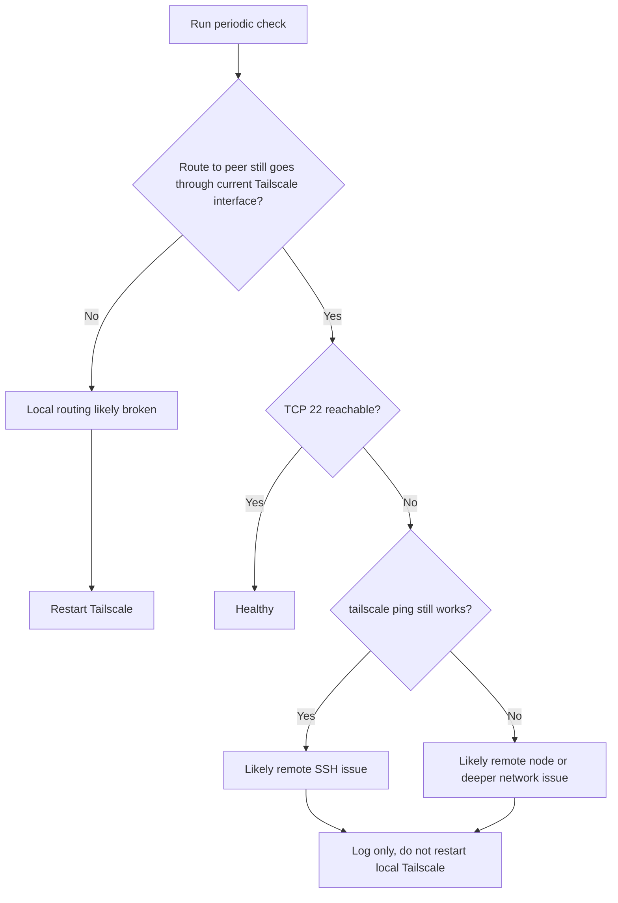

# tailscale-shadowrocket-ssh-heal

Self-healing scripts and documentation for a macOS routing conflict where Tailscale stays online, but native SSH breaks after Shadowrocket-like packet tunnel apps change system routes.

一个针对 macOS 上 Tailscale 与 Shadowrocket 类 TUN 应用路由争用问题的原生 SSH 自愈方案。

## Why This Exists

这个项目解决的是一个很容易让人误判的问题：

- `tailscale status` 看起来正常
- `tailscale ping` 往往也还能通
- 但原生 `ssh user@100.x.x.x` 已经失败
- 手动执行一次 `tailscale down && tailscale up` 后，SSH 往往又恢复

根因并不是“SSH 协议和 Tailscale 冲突”，而是：

- Shadowrocket 一类 Packet Tunnel 应用会修改系统路由
- Tailscale 也依赖自己的虚拟隧道和路由归属
- 某些切换代理、切节点、关闭代理的时刻，普通应用的系统流量会偏离 Tailscale 当前实际使用的接口

这个仓库把问题背景、排查方法、脚本实现和自愈策略都整理成了一套可复用的资料。

## What It Does

- 检测目标流量是否仍然走到当前 Tailscale 接口
- 检测目标 SSH 端口是否真的可达
- 用 `tailscale ping` 作为辅助信号，降低误判
- 只在更像“本机 Tailscale/本机路由问题”时才自动重启 Tailscale
- 用 `launchd` 做后台定时巡检，支持睡眠唤醒后的补检
- 记录中文日志、状态文件和动态退避信息

## Detection Model



## Repository Layout

```text
.
├── README.md
├── docs
│   └── DEEP_DIVE.md
└── scripts
    ├── restart-tailscale.sh
    ├── check-and-heal-tailscale-ssh.sh
    └── watch-tailscale-ssh.sh
```

## Quick Start

### 1. Clone the repo

```bash
git clone git@github.com:KaiXinChaoRen1/tailscale-shadowrocket-ssh-heal.git
cd tailscale-shadowrocket-ssh-heal
```

### 2. Make scripts executable

```bash
chmod +x scripts/restart-tailscale.sh
chmod +x scripts/check-and-heal-tailscale-ssh.sh
chmod +x scripts/watch-tailscale-ssh.sh
```

### 3. Start the watcher

```bash
zsh scripts/watch-tailscale-ssh.sh start
```

默认参数：

- 目标 IP：`100.82.42.75`
- 目标端口：`22`
- 基础检查间隔：`180` 秒

### 4. Useful commands

```bash
zsh scripts/watch-tailscale-ssh.sh status
zsh scripts/watch-tailscale-ssh.sh restart
zsh scripts/watch-tailscale-ssh.sh stop
zsh scripts/watch-tailscale-ssh.sh restart 100.82.42.75 22 180
```

## How It Runs

- 使用 macOS `launchd` 的 `StartInterval`
- 每次只运行一次，不保留长期 `while true + sleep` 守护进程
- 真正的间隔退避逻辑由状态文件控制
- 如果笔记本在睡眠期间错过检查点，唤醒后会更快补跑一次

这比传统的常驻死循环更适合笔记本电脑，也更省资源。

## Logs and State

日志文件：

```bash
~/Library/Logs/tailscale-ssh-heal.log
```

状态文件：

```bash
~/Library/Application Support/tailscale-ssh-heal/state.env
```

日志会记录：

- 后台巡检启动
- 本机异常并已触发重启
- 异常但未触发重启
- 退避生效
- 恢复正常
- 脚本错误

## Who This Is For

这个项目更适合下面这些人：

- 在 macOS 上同时使用 Tailscale 和 Shadowrocket / Clash / Surge / 其他 TUN 类代理的人
- 想用原生 `sshd`，而不是 Tailscale SSH 的人
- 遇到“`tailscale ping` 通，但原生 SSH 不通”的人
- 想把问题查清楚，而不只是临时重启一下的人

## Limitations

这不是通用网络修复器。它主要适用于：

- Tailscale 本身大体仍然能运行
- 原生 `sshd` 已开启
- 问题主要来自多隧道并存时的路由归属偏移
- 重启 Tailscale 对你当前这类问题通常有效

它不负责修复这些问题：

- 远端机器自己没开 SSH
- Tailscale 账号或控制面本身故障
- 更大范围的网络中断
- 任意数量远端目标的复杂策略编排

## Documentation

- 快速了解项目：[`README.md`](./README.md)
- 详细背景、排查与原理：[`docs/DEEP_DIVE.md`](./docs/DEEP_DIVE.md)

## Disclaimer

- 本项目不是 Tailscale 或 Shadowrocket 官方项目
- 本项目默认只针对当前机器的 Tailscale 服务做保守自愈
- 使用前请先理解脚本逻辑，并确认你接受“异常时自动重启 Tailscale”这一行为

## License

[MIT](./LICENSE)
